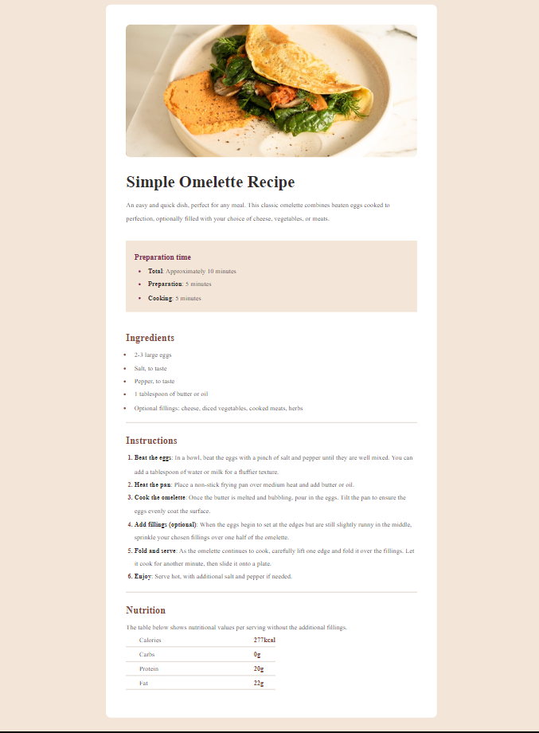
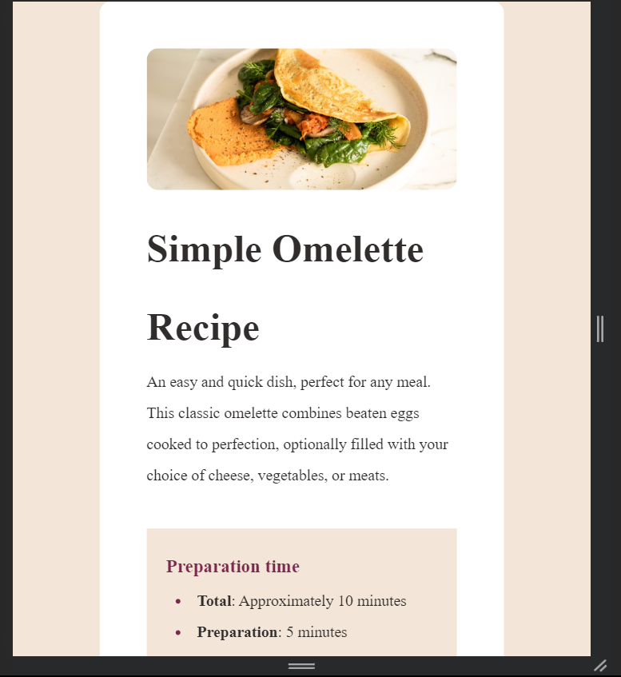

# Frontend Mentor - Recipe page solution

This is a solution to the [Recipe page challenge on Frontend Mentor](https://www.frontendmentor.io/challenges/recipe-page-KiTsR8QQKm). Frontend Mentor challenges help you improve your coding skills by building realistic projects. 

## Table of contents

- [Overview](#overview)
  - [The challenge](#the-challenge)
  - [Screenshot](#screenshot)
  - [Links](#links)
- [My process](#my-process)
  - [Built with](#built-with)
  - [What I learned](#what-i-learned)
  - [Continued development](#continued-development)
  - [Useful resources](#useful-resources)
- [Author](#author)

## Overview

### Screenshot

### Links

- Solution URL: (https://github.com/hassanmoaa/recipe-page-component-FrontEndMentor.git)
- Live Site URL: (https://splendorous-cucurucho-bf4a60.netlify.app/)

### Built with

- Semantic HTML5 markup
- CSS custom properties
- Flexbox
- Google Fonts

### What I learned

I've learned using classes properly, enhanced my CSS skills and how to style elements in a more modular way by creating reusable components.

Also Styling Sections and Uls

It gived me motivation to pursue more Front-end challenges as it sharpens my skills while doing it!

- /*Main-Adjustements*/
.container {
    display: flex;
    flex-direction: column;
    justify-content: center;

    width: 70%;
    max-width: 800px;

    margin: 6rem auto;
    background-color: var(--white);
}

.hero {
    padding: 3rem;
    border-radius: 12px;
}

.omelette-image {
    width: 100%;
    background-size: cover;
    border-radius: 12px;
}

### Continued development

- I want to learn more about css by creating multi-page websites

### Useful resources

-(https://www.w3schools.com) - W3S helped me getting some help!

## Author

- Frontend Mentor - [@hassanmoaa](https://www.frontendmentor.io/profile/hassanmoaa)
